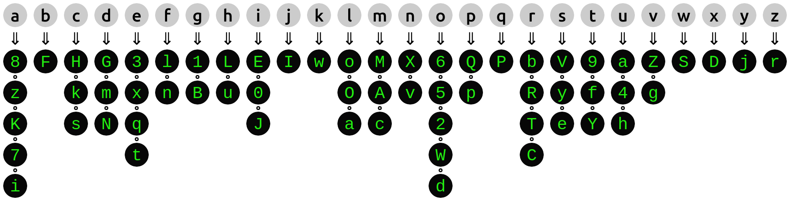

# Crypto Cypher

O Crypto Cypher é uma aplicação que criptografa uma mensagem e revela uma mensagem já criptografada, através do *método da substituição homofônica*, respeitando um [alfabeto](#o-alfabeto) e seus grupos de caracteres.

## Cifra de Substituição Homofônica

Este método consiste em definir um grupo de caracteres para cada caractere do alfabeto, onde esses grupos podem ser maiores para caracteres que são mais comuns em um texto e menores caso contrário, mas não necessariamente. No processo de criptografia, cada caractere da mensagem original é substituído aleatoriamente por um caractere de seu grupo.

### O alfabeto

Abaixo está disposta a estrutura do alfabeto e seus grupos de caracteres:

Na primeira linha, na cor branca, estão todos os caracteres do alfabeto. Cada caractere aponta para uma coluna de caracteres, indicando qual é o seu grupo, ou seja, quais caracteres irão substituí-lo ao criptografar a mensagem.

Este mapa também pode ser encontrado no próprio Crypto Cypher, em *Informações*, no canto superior direito.

## Utilização do Crypto Cypher

Os processos de encriptação e decriptação do Crypto Cypher são automáticos. A cada alteração em qualquer um dos campos de mensagem, o resultado obtido será exibido no campo oposto, ou seja, ao inserir ou modificar uma mensagem no campo *Mensagem revelada*, a mensagem criptografada aparecerá imediatamente no campo *Mensagem cifrada*, e vice-versa.

### Opções e agrupamento de caracteres

Assim que qualquer mensagem for inserida, alguns botões de opções estarão disponíveis no canto superior direito de cada campo e um contador de *bytes* para a mensagem cifrada é exibido no canto superior esquerdo deste campo, bem como uma opção de remover espaços e uma outra de configuração do tamanho do agrupamento, ambas para a mensagem cifrada, logo abaixo.

As opções dos botões são, respectivamente:

- Apagar as mensagens e retomar o foco no campo.
- Copiar toda a mensagem.
- Salvar a mensagem em um arquivo localmente.

Todas estas opções são relativas ao campo na qual os botões pertencem. O contador de *bytes* conta a quantidade de caracteres que a mensagem cifrada possui. A opção de remover os espaços tem o intuito de comprimir o tamanho da mensagem cifrada, ao mesmo tempo em que a torna mais incompreensível. A configuração de tamanho do agrupamento indica que, ao separar o texto por espaços, serão mantidos grupos desta quantidade de caracteres sem espaços. O tamanho pode variar de 0 a 100, onde 0 é o padrão e significa que não há agrupamento, mantendo as características do texto revelado. O agrupamento de caracteres também serve para tornar a mensagem cifrada mais incompreensível.

### *Timer* e contadores

No rodapé da página são observados alguns contadores. Eles indicam, respectivamente, o seguinte:

- O tempo que cada processo demorou para ser executado.
- O total de caracteres que compõem a mensagem revelada.
- A quantidade de caracteres que foram substituídos pelo processo de encriptação.

Estes contadores são atualizados toda vez que ocorre uma mudança em uma das mensagens e, também, sempre que os espaços são removidos ou o tamanho do agrupamento é alterado.